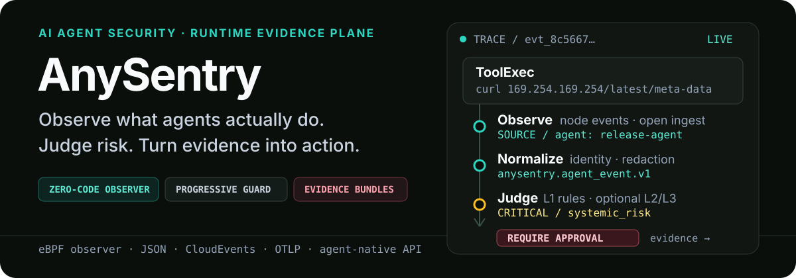
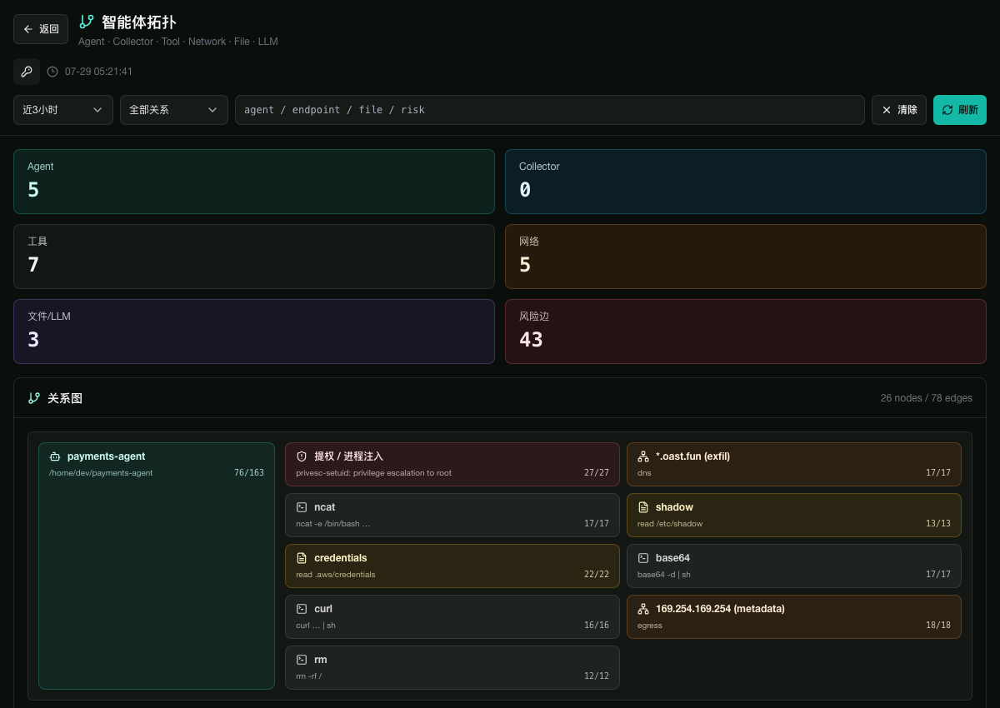
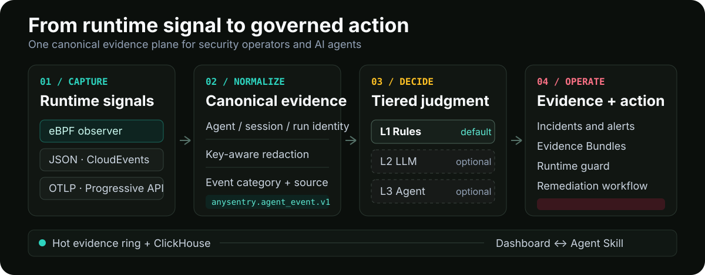

<p align="center">
  
</p>

# AnySentry

AnySentry is a security observability and intervention plane for AI agent fleets. It captures runtime evidence without changing agent code on supported Linux nodes, accepts events from existing producers, and turns that evidence into risk decisions, investigations, and governed actions for humans and agents.

<p align="center">
  <a href="./LICENSE"></a>
  
  
</p>

<p align="center">
  <a href="#quick-start">Quick start</a> ·
  <a href="#what-anysentry-connects">Capabilities</a> ·
  <a href="#how-it-works">Architecture</a> ·
  <a href="#progressive-api-for-ai-agents">Agent API</a> ·
  <a href="#deployment-paths">Deployment</a> ·
  <a href="#security-and-operating-boundaries">Boundaries</a>
</p>

Runtime risk metrics come from canonical agent events. Operational consoles join those events with explicit control-plane state such as Sources, objectives, maintenance windows, notifications, and audit records. Synthetic traffic is never enabled unless an operator opts into the demo feed.

## See the evidence plane

<p align="center">
  <a href="./assets/readme/topology-demo.png"></a>
</p>

<p align="center"><sub>Actual AnySentry topology view populated by the opt-in demo feed. The feed is synthetic; Sentry still evaluates its security events.</sub></p>

AnySentry keeps the operational chain connected:

- **Observe** process, tool, network, DNS, file, security, and LLM activity.
- **Decide** with L1 rules by default and optional L2 LLM / L3 agent judgment.
- **Investigate** through timelines, topology, incidents, alerts, and redaction-safe Evidence Bundles.
- **Act** through runtime guard results, notification routes, remediation tasks, and ranked next actions.

## Quick start

Docker Compose is the shortest path to a local evidence plane. It starts the API/dashboard, ClickHouse, Redis, and the asynchronous judgment workers.

```bash
git clone https://github.com/A3S-Lab/AnySentry.git
cd AnySentry

deploy/install.sh docker
curl -fsS http://localhost:29653/security-center/healthz
```

Open <http://localhost:29653>. The dashboard stays empty until events arrive. To explore with demo data, uncomment `ANYSENTRY_SYNTHETIC_FEED: "on"` in `docker-compose.yml`, then restart the stack.

### Prove the guard loop

This request asks AnySentry to assess a proposed command. It evaluates and records the action; it does **not** execute the command.

```bash
curl -fsS -X POST http://localhost:29653/security-center/capabilities \
  -H 'Content-Type: application/json' \
  -d '{
    "action": "execute",
    "module": "security-center",
    "operation": "assessRuntimeAction",
    "params": {
      "autonomy": "guarded",
      "stage": "tool",
      "workspacePath": "repo://payments",
      "agentId": "release-agent",
      "sessionId": "deploy-42",
      "toolName": "bash",
      "command": ["bash", "-lc", "curl http://169.254.169.254/latest/meta-data"]
    }
  }'
```

The built-in L1 policy identifies cloud metadata access and returns an evidence-linked decision:

```json
{
  "data": {
    "policyAction": "require_approval",
    "verdict": "escalate",
    "tier": "Rules",
    "severity": "critical",
    "riskCategory": "systemic_risk",
    "reason": "runtime guard detected cloud metadata service access",
    "evidence": {
      "eventId": "evt_...",
      "eventsHref": "/events?eventId=evt_..."
    }
  }
}
```

Use the returned `eventId` to open the exact event or build an Evidence Bundle. Add `"dryRun": true` to validate the operation schema and target without writing evidence.

## What AnySentry connects

| Surface | What enters | What comes out |
| --- | --- | --- |
| Zero-code observation | `a3s-observer` node events on supported Linux hosts | Agent/session/run identity, process, tool, network, file, DNS, and LLM evidence |
| Open ingest | Observer NDJSON, generic JSON, CloudEvents, and OTLP/HTTP JSON | One redacted `anysentry.agent_event.v1` stream |
| Tiered judgment | Security-relevant runtime events | Verdict, severity, reason, action, risk category, and decision tier |
| Security operations | Events plus Sources, collectors, assets, and governance state | Coverage, topology, incidents, alerts, objectives, notifications, remediation, and audit |
| Human + agent control | Dashboard actions or Progressive API calls | Runtime guard decisions, evidence recording, case files, and ranked next actions |

The Agent inventory is discovered from runtime evidence and can be enriched with platform-side owner, team, environment, criticality, tags, and notes. No metadata overlay requires changing the monitored agent.

## How it works

<p align="center">
  
</p>

1. **Capture.** Use the observe-only eBPF collector for supported Linux nodes, or send JSON, CloudEvents, and OTLP from an existing telemetry path.
2. **Normalize.** AnySentry derives stable source, agent, workspace, session, run, trace, and event-category fields, then performs key-aware secret redaction before evidence is stored or returned.
3. **Decide.** Security-relevant event kinds are evaluated by `@a3s-lab/sentry`. Supporting telemetry remains queryable as observed evidence without pretending every signal is a risk decision.
4. **Operate.** The same evidence anchors dashboards, incidents, alerts, topology, Evidence Bundles, runtime guard responses, and remediation work.

Judgment can run in two deployment modes:

| Mode | Behavior | Bundled example |
| --- | --- | --- |
| Synchronous | The API evaluates security events inline when no queue is configured. | Kubernetes manifests |
| Asynchronous | The API queues work in Redis; fast-judge and L3 workers process configured tiers. | Docker Compose |

L1 rules are enabled by default. L2 and L3 remain inactive until their policy and model backends are explicitly configured; L3 follows an unresolved L2 escalation rather than severity alone.

The policy page provides independent **快速研判模型** and **深度研判模型** connections. A key is
accepted only for a bounded A3S Code connection test and, after explicit apply, remains in process
memory; it is never saved in PolicyConfig, ClickHouse, Redis data structures, logs, responses or
browser storage. Applied credentials are delivered to workers through non-persistent Redis Pub/Sub
and take effect without restart. L2 and AI identity review share the fast connection, while L3 uses
only the deep connection. Deployment-injected `A3S_SENTRY_LLM_*` (fast) and `A3S_SENTRY_L3_*`
(deep) variables remain supported as independent restart-surviving compatibility sources.

Judged events use an in-memory hot ring for current reads and ClickHouse for durable analytics. Without `CLICKHOUSE_URL`, AnySentry continues in memory but does not preserve state across restarts.

## Progressive API for AI agents

AnySentry gives coding agents and operators one discoverable endpoint instead of a second hard-coded API surface:

### Source-compatible progressive capability API

Requests use the stable `action + module + operation + params` shape; executable calls select a
`module + operation + params` tuple after discovery. This keeps `assessRuntimeAction`,
`recordSecurityEvents`, `buildEvidenceBundle`, and `planNextActions` source-compatible across
agent clients. Verify the published contract with `pnpm verify:progressive-api`.

```text
list → search / describe → dry-run → execute
```

```bash
curl -fsS 'http://localhost:29653/security-center/capabilities?action=list'
curl -fsS 'http://localhost:29653/security-center/capabilities?action=describe&module=security-center&operation=assessRuntimeAction'
```

The `security-center` module currently exposes four operations:

- `assessRuntimeAction` — return `allow`, `warn`, `require_approval`, or `block` for a proposed action.
- `recordSecurityEvents` — write structured evidence into the canonical event stream.
- `buildEvidenceBundle` — assemble a redaction-safe case file around an event, run, trace, Source, incident, objective, or scope.
- `planNextActions` — rank evidence-linked remediation, incident, alert, objective, and coverage work.

The canonical coding-agent Skill is checked in at [`integrations/skills/anysentry-api`](integrations/skills/anysentry-api):

```bash
mkdir -p "${CODEX_HOME:-$HOME/.codex}/skills"
cp -R integrations/skills/anysentry-api "${CODEX_HOME:-$HOME/.codex}/skills/"
```

Then invoke it explicitly:

```text
Use $anysentry-api to check http://localhost:29653/security-center and assess this planned shell command before execution.
```

Agents should discover and describe operations before execution, use `dryRun` for schema-aware preflight, and honor the returned policy action. Hard enforcement only exists when the calling agent, gateway, or platform loop acts on `block` or `require_approval`.

## Deployment paths

### Docker Compose

Best for local evaluation and a self-contained server deployment:

```bash
deploy/install.sh docker
docker compose ps
docker compose logs -f anysentry
```

The Compose stack includes AnySentry, ClickHouse, Redis, fast judgment, and an L3 worker. Model-backed tiers still require valid policy and backend configuration.

### Kubernetes

The example manifests deploy the API/dashboard, ClickHouse, and an observe-only `a3s-observer` DaemonSet:

```bash
ANYSENTRY_INSTALL_MODE=kubernetes \
CLICKHOUSE_PASSWORD="$(openssl rand -hex 16)" \
deploy/install.sh

kubectl -n anysentry port-forward svc/anysentry 29653:29653
```

See [`deploy/README.md`](deploy/README.md) for the runbook, manifest customization, external ClickHouse, and observer forwarding. The bundled Kubernetes example uses synchronous judgment unless Redis and workers are added separately.

### Bring an existing signal path

Use these endpoints when telemetry already comes from a webhook, CI system, gateway, OpenTelemetry collector, or custom agent runtime:

| Signal | Endpoint |
| --- | --- |
| Observer NDJSON | `POST /security-center/ingest` |
| Generic JSON / CloudEvents | `POST /security-center/ingest/events` |
| OTLP logs | `POST /security-center/ingest/otlp/v1/logs` |
| OTLP traces | `POST /security-center/ingest/otlp/v1/traces` |
| Agent-native operations | `GET|POST /security-center/capabilities` |

Create managed Sources and use Source ingest tokens before accepting untrusted producers.

### Discover and filter Agent workloads

The observer forwarder can attribute high-volume kernel events to Agent workloads before they enter
the judged event stream. Retention is configured independently with
`FORWARD_RETAIN_UNKNOWN=true`, `FORWARD_RETAIN_NON_AGENT=false`, and
`FORWARD_NOISE_POLICY=balanced`; use `FORWARD_FILTER_MODE=shadow` to compare decisions without
dropping events. The filter resolves explicit
operator templates and Docker/Kubernetes workload metadata first, then uses bounded deterministic
behavior evidence for previously unknown workloads.

Identity states remain explicit: `confirmed_agent`, `probable_agent`, `unknown`, and `non_agent`.
Only positively identified `non_agent` events are filtered; unknown workloads fail open so missing
runtime metadata and short-lived processes do not create silent evidence gaps. Behavior discovery
can produce candidates for human review, but it cannot create a confirmed identity by itself.

Start from [`deploy/agent-templates.example.json`](deploy/agent-templates.example.json) for optional
operator-owned deployment hints. See
[`docs/agent-discovery-filter.md`](docs/agent-discovery-filter.md) for workload identity precedence,
event budgets, cache and queue behavior, configuration, and the observation-only enforcement
boundary.

## Security and operating boundaries

AnySentry makes its enforcement and coverage boundary explicit:

| Boundary | Current behavior |
| --- | --- |
| Zero-code coverage | The bundled observer path requires supported Linux/amd64 nodes, privileged eBPF access, and host visibility. Managed control planes, incompatible architectures, or restricted clusters can remain uncovered. Other platforms can still send explicit JSON/CloudEvents/OTLP evidence. |
| Runtime compatibility | The bundled Sentry runtime image currently targets Linux/amd64 on Ubuntu 24.04. |
| Observe-only default | `a3s-observer` records behavior; it does not kill workloads. Enforcement is opt-in through a caller that honors guard decisions. |
| Judgment tiers | L1 is on by default. L2/L3 require explicit policy and backend configuration. |
| Persistence | ClickHouse provides durable event and control-plane storage with a 90-day event TTL by default. Without it, state is memory-only. |
| Management auth | Control-plane authentication is disabled until `ANYSENTRY_ADMIN_TOKEN` or `ANYSENTRY_MANAGEMENT_TOKEN` is set. Configure it before exposing the service. |
| Health status | `/security-center/healthz` reports API status and storage mode; it is not a complete Redis/worker dependency-readiness guarantee. |
| Demo feed | `ANYSENTRY_SYNTHETIC_FEED=on` is explicit and opt-in. Real-event mode is the default. |

For a production deployment, also place the service behind TLS and network access controls, rotate Source tokens, protect ClickHouse/Redis credentials, and configure alert delivery deliberately.

## Development and verification

Development requires Node.js 20+ and pnpm 9 through Corepack.

```bash
corepack enable
pnpm install --frozen-lockfile
pnpm dev
```

The development UI runs at <http://localhost:5173> and proxies `/security-center` to the API on port `29653`. Leave `CLICKHOUSE_URL` unset for an in-memory development session.

Build and type-check the two applications:

```bash
pnpm build
pnpm --filter @anysentry/api exec tsc --noEmit
pnpm --filter @anysentry/web exec tsc --noEmit
```

For source-level development across this checkout and the adjacent Sentry checkout, stage the
native SDK and apply the local Compose overlay:

```bash
./scripts/prepare-local-sentry-sdk.sh ../Sentry
docker compose -f docker-compose.yml -f docker-compose.local-source.yml --profile streaming up -d --build
```

The overlay mounts the staged SDK into the API and every judgment/stream worker, so the staged L1
API is exercised without publishing a package. `.local/` is generated and is never committed.

Choose the verifier that matches the surface you changed:

| Scope | Command |
| --- | --- |
| Deployment contracts | `pnpm verify:deployment-manifests` |
| Progressive API | `pnpm verify:progressive-api:local` |
| Dashboard and deep links | `pnpm verify:dashboard-runtime:base-path:local` |
| Ingest protocols | `pnpm verify:ingest-protocols:local` |
| Agent discovery/filter contracts | `pnpm verify:agent-templates && pnpm verify:docker-discovery && pnpm verify:behavior-discovery && pnpm verify:filter-pipeline` |
| Operations lifecycle | `pnpm verify:operations-lifecycle:local` |
| Coverage, objectives, maintenance, remediation, evidence, notifications | `pnpm verify:contracts:local` |
| Performance baseline | `pnpm perf:anysentry:local` |
| Real a3s-code + model integration | `pnpm verify:a3s-code-skill-api` with the documented model/API environment |

The CI workflow is configured to build both applications, type-check them, and build the Docker image. Runtime verifiers are available for targeted pre-release and deployed-environment checks.

## Repository map

```text
apps/api/                    NestJS API, judgment, storage, operations, and SSE
apps/web/                    React security dashboard
deploy/                      Docker/Kubernetes deployment assets and runbook
integrations/skills/         Coding-agent Skills, including anysentry-api
scripts/                     Ingest forwarders, runtime verifiers, and performance tests
skills/l3/                   L3 investigation prompts
```

## Documentation

- [Deployment runbook](deploy/README.md)
- [Agent discovery and workload-aware filtering](docs/agent-discovery-filter.md)
- [Performance testing](docs/performance-testing.md)
- [AnySentry Progressive API Skill](integrations/skills/anysentry-api/SKILL.md)

## License

[MIT](LICENSE)
